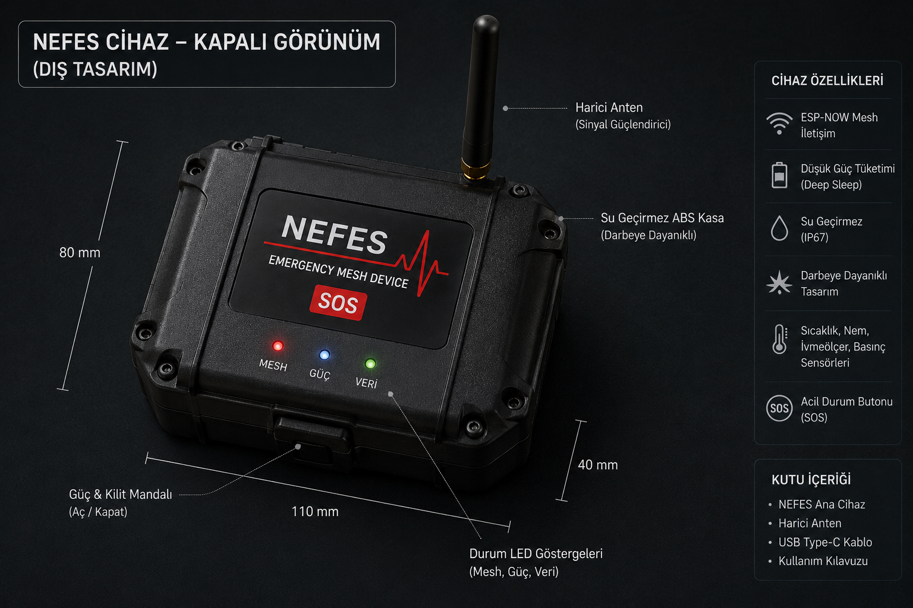

# NEFES
## Network of Emergency Formative ESP32 System

NEFES, afet anlarında GSM ve internet altyapısının çökmesi durumunda, ESP-NOW tabanlı merkeziyetsiz bir Mesh ağ kurarak enkaz altındaki bireylerin konum ve sağlık verilerini arama-kurtarma ekiplerine ulaştırmayı amaçlayan otonom acil durum haberleşme sistemidir.

---

# PROJE AMACI

Afet anlarında iletişim altyapısının devre dışı kalması nedeniyle oluşan bilgi kopukluğunu ortadan kaldırmak ve enkaz altındaki bireylerin sağlık/veri durumunu kurtarma ekiplerine ulaştırmak.

---

# SİSTEM ÖZELLİKLERİ

- ESP-NOW Mesh Haberleşme
- Multi-Hop Veri Aktarımı
- Pasif Veri Yayını (Beaconing)
- Deep Sleep Güç Yönetimi
- Merkeziyetsiz Ağ Yapısı
- Düşük Güç Tüketimi
- Su Geçirmez Modüler Tasarım

---

# KULLANILAN DONANIMLAR

- ESP32 DevKit
- Li-Po Batarya
- Harici Anten
- Sensör Modülleri
- Su Geçirmez ABS Kasa

---

# TEKNİK ÖZELLİKLER

| Özellik | Değer |
|---|---|
| Haberleşme Protokolü | ESP-NOW |
| Ağ Yapısı | Mesh (Multi-Hop) |
| Çalışma Frekansı | 2.4 GHz |
| Pil Süresi | 5-7 Gün |
| Veri İletimi | Pasif Beaconing |
| Güç Yönetimi | Deep Sleep |
| Kasa | IP67 ABS |

---

# PROJE GÖRSELLERİ

## Görseller

### Mesh Ağ Yapısı

### Teknik Sistem Şeması

### Mobil Uygulama

### Prototip Cihaz

### Kapalı Cihaz
-

---
# TEKNOFEST 2026

İnsanlık Yararına Teknolojiler Yarışması  
Akıllı Teknolojiler ve Sistem Tasarımı Kategorisi
